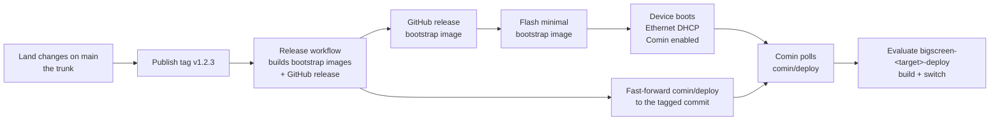

# Plasma Bigscreen TV Interface (NixOS)

A NixOS flake that turns a machine into a KDE Plasma Bigscreen "10-foot"
TV interface, with an ad-free YouTube client (VacuumTube) pinned to the
home screen.

Two independent hardware targets are provided so you can test the whole
software stack in a VirtualBox VM before flashing a real Raspberry Pi 4:

| Configuration      | Hardware                          | Architecture   |
|---------------------|------------------------------------|----------------|
| `bigscreen-rpi4`    | Raspberry Pi 4 Model B (SD card)   | `aarch64-linux`|
| `bigscreen-vbox`    | Oracle VirtualBox VM               | `x86_64-linux` |

Both share the same desktop/software configuration
([hosts/common.nix](./hosts/common.nix) and
[modules/bigscreen.nix](./modules/bigscreen.nix)); only the hardware
modules ([hosts/hardware-rpi4.nix](./hosts/hardware-rpi4.nix) and
[hosts/hardware-vbox.nix](./hosts/hardware-vbox.nix)) differ.

## Deploying with Comin (GitOps)

The preferred way to run these machines is *pull-mode GitOps*: flash a minimal
"bootstrap" image once, and let [Comin](https://github.com/nlewo/comin) pull the
machine's real configuration from this repository's **`comin/deploy`** branch and
apply it. The desktop software is never baked into the bootstrap image, so new
bootstrap images stay small and application changes ship as ordinary commits.

The repo follows **trunk-based development**: work lands on `main` through
short-lived feature branches, and a tag cuts a release from `main`. The oddity
is `comin/deploy` — it only exists because Comin follows a *branch*, not a tag.
CI maintains it: the release workflow fast-forwards it to whatever commit a tag
points at, so devices only ever see released commits.

Practically:

- **Every change gets its own branch**, cut from `origin/main`
  (`git checkout -b my-feature origin/main`) — never develop on `main` itself.
  Short-lived branches are what make developing several features in parallel
  possible; `main` is the integration point, not anyone's working branch.
- **Land the branch back into `main`** when it is ready (a pull request, or a
  fast-forward merge) and delete it. Unfinished work stays on its branch —
  long-lived divergent branches are exactly the failure mode this avoids.
- **Tag `main` to release**: the workflow publishes the bootstrap images and
  fast-forwards `comin/deploy` to the tagged commit.

### The lifecycle



Three things can move a machine or produce an artifact:

| Ref | Role | Effect on a device |
|-----|------|--------------------|
| `main` | Trunk: review and land changes here | None by itself — nothing polls `main` |
| `v*` tags | Mark a release cut from the trunk | The release workflow builds bootstrap images **and fast-forwards `comin/deploy` to the tagged commit — every device deploys it** |
| `comin/deploy` | Release branch, maintained by CI, fast-forward-only | Every commit is pulled, evaluated and deployed |

So releasing and deploying are one act: **tag `main`** and the workflow publishes
the release images and moves every device to the tagged commit. `comin/deploy`
is not hand-edited except for an urgent hotfix; a hotfix push must still be a
fast-forward, and must be reconciled into `main` so the next tag is a descendant
of it.

> **Why fast-forward only:** Comin deploys a moving branch and rejects a
> `comin/deploy` that is reset or rewritten behind a commit a device has already
> deployed, so the workflow's deploy step enforces exactly that.

### Outputs

| Output | Purpose |
|--------|---------|
| `bigscreen-rpi4-bootstrap` | Minimal Pi 4 SD-card image (bootstrapping only) |
| `bigscreen-vbox-bootstrap` | Minimal VirtualBox appliance (bootstrapping only) |
| `bigscreen-rpi4-deploy` | The Pi configuration Comin evaluates and deploys |
| `bigscreen-vbox-deploy` | The VirtualBox configuration Comin evaluates and deploys |

[hosts/deployment-selection.nix](./hosts/deployment-selection.nix) maps each
target to a profile (`bootstrap` or `full`); it is the only place promotion is
expressed. Comin always evaluates `bigscreen-<target>-deploy`, never an
image-builder output.

### Build and flash a bootstrap image

```sh
nix build .#nixosConfigurations.bigscreen-rpi4-bootstrap.config.system.build.sdImage
# -> result/sd-image/*.img.zst
```

Flash it with Raspberry Pi Imager ("Use custom image") or manually:

```sh
zstd -d result/sd-image/*.img.zst -o bigscreen-rpi4-bootstrap.img
# then flash bigscreen-rpi4-bootstrap.img with your tool of choice
```

### Publish a release (and deploy it) by tag

Push a semantic-version tag such as `v1.2.3`. The
[release workflow](./.github/workflows/release-rpi4-bootstrap.yml) builds both
bootstrap images in parallel and attaches them to a GitHub release for that tag:

- `bigscreen-rpi4-bootstrap-v1.2.3.img.zst` (built on an ARM64 runner) plus `.sha256`;
- `bigscreen-vbox-bootstrap-v1.2.3.ova` (built on an x86_64 runner) plus `.sha256`.

Once the release is published, the workflow **fast-forwards `comin/deploy` to
the tagged commit**, so devices deploy the release on their next poll. The tag
must be a descendant of `comin/deploy` (i.e. cut from a `main` that already
contains it); otherwise the deploy step fails with guidance instead of rewriting
the branch. Only tags matching `v<major>.<minor>.<patch>` are accepted.

### First boot and recovery

- Connect **Ethernet**; the bootstrap image uses DHCP through NetworkManager.
- **SSH is enabled key-only** in every configuration (bootstrap and full): see
  [hosts/ssh.nix](./hosts/ssh.nix) and the committed public key
  [hosts/bigscreen.pub](./hosts/bigscreen.pub). Password and root login are
  disabled, so only someone holding the matching private key can log in as
  `htpc`. Its private key is **not** in the repository. This also lets you reach
  a machine whose display is not working. HDMI/keyboard access still works for
  local recovery.
- Once online, Comin starts automatically, fetches `comin/deploy`, evaluates the
  matching `bigscreen-<target>-deploy` output, builds it and runs
  `switch-to-configuration switch`.
- If the network, GitHub, the branch or an output is unavailable, the machine
  keeps running its current (last good) system and Comin retries.

### Promoting a machine to the full desktop

Edit [hosts/deployment-selection.nix](./hosts/deployment-selection.nix) on
`main`, then release it:

```sh
# on main: set e.g. vbox = "full"; then
git commit -am "Select full Bigscreen profile for the VirtualBox target"
git tag v1.3.0 && git push origin main v1.3.0
```

The workflow publishes the release and fast-forwards `comin/deploy` to the tag;
within the poll interval (60s) the machine builds and activates the new profile.
A direct push to `comin/deploy` remains possible for an urgent hotfix, but it
must be a fast-forward (never force-push or reset it behind a commit a machine
has already deployed) and must be merged back into `main` so the next tag is a
descendant of it.

**Rolling back.** Comin deploys a *store path* and remembers the ones it has
already switched to. A revert that reproduces a store path already in the
deployment history is **skipped**, so the device keeps the newer generation —
a pure `git revert` can therefore fail to roll back. To roll a device back,
land a change that produces a *new* store path (e.g. add any real change to the
reverted config), or roll back on the host itself. This was observed directly
during testing.

### Observing and troubleshooting

```sh
comin status                 # current selection and deployment state
journalctl -u comin -n 50    # fetch/eval/build/deploy log
cat /var/lib/comin/state.json
readlink -f /run/current-system
```

`switch-to-configuration switch` updates userspace and the boot entry but does
**not** change the running kernel; reboot when a deployed change requires it.
Because a machine always follows the moving `comin/deploy` branch, a freshly
flashed image converges to whatever that branch currently selects, not
necessarily to the bootstrap state it was flashed with.

If Comin stops picking up commits after a reboot or clock jump, restart the
service (`sudo systemctl restart comin`) to re-arm its poller; this was observed
during testing. `comin status` shows the last fetch and deployment times.

> **Trust boundary:** `comin/deploy` is read without credentials, but anything
> merged into it is deployed to these machines and can administer them. It is
> normally written only by the release workflow's `GITHUB_TOKEN`; consider
> protecting the branch so direct pushes are limited to that (plus reviewed
> hotfixes). Protect the branch accordingly.

### Manual (non-GitOps) use

The pre-existing `bigscreen-rpi4`, `bigscreen-vbox` and `bigscreen-iso` outputs
remain available for direct `nixos-rebuild` / manual image builds.

## What you get

- **KDE Plasma Bigscreen** (`kdePackages.plasma-bigscreen`), auto-starting
  on boot via SDDM autologin into the `plasma-bigscreen-wayland` session.
- **VacuumTube** (`vacuum-tube`) — an open-source YouTube "Leanback" client
  built for TV/remote-friendly navigation. It talks to YouTube without the
  official app/website, so there are **no ads and no sign-in requirement**.
- **A media/desktop app set** in the Bigscreen launcher (see below).
- **An app store** — KDE **Discover** backed by **Flatpak/Flathub**, so extra
  apps can be installed occasionally without a rebuild.
- PipeWire audio, KDE Connect (for phone-as-remote control), and a
  `htpc` user with autologin enabled.

The default account is `htpc` with **no password** (passwordless local login and
`sudo`); `root` likewise has no password. Remote SSH is **key-only** — password
and root login are disabled and the machine trusts the public key in
[hosts/bigscreen.pub](./hosts/bigscreen.pub) (its private key is not in the
repository). To add another key, drop a `.pub` in `hosts/` and add it to
`users.users.htpc.openssh.authorizedKeys.keyFiles` in
[hosts/ssh.nix](./hosts/ssh.nix).

## Applications

Declared in [modules/apps.nix](./modules/apps.nix). The Bigscreen launcher is
organised into **Media / Games / Utilities / Other** sections by
[modules/bigscreen-launcher/LauncherHome.qml](./modules/bigscreen-launcher/LauncherHome.qml):

| Section | Apps |
|-----------|---------------------------------------------------------|
| Media | VacuumTube, Stremio, Spotify, Kodi, Jellyfin, Open TV |
| Games | Steam Link, Moonlight |
| Utilities | Zen Browser, Discover, Konsole, Trayscale |
| Other | everything else (Dolphin, Kate, Notepad Next, Blanket, …) |

| App | Source |
|---------------------|-------------------------------------------|
| VacuumTube (ad-free YouTube) | nixpkgs |
| Stremio | Flatpak (Flathub) |
| Kodi | nixpkgs |
| Jellyfin Media Player | nixpkgs |
| Open TV | Flatpak (Flathub) |
| Spotify | nixpkgs |
| Moonlight | nixpkgs |
| Steam Link | Flatpak (Flathub) |
| Zen Browser | Flatpak (Flathub) |
| Konsole (terminal) | nixpkgs (`kdePackages.konsole`) |
| Dolphin (file manager) | nixpkgs (`kdePackages.dolphin`) |
| Kate / Notepad Next (editors) | nixpkgs |
| Blanket (ambient sound) | nixpkgs |
| Trayscale (Tailscale GUI) | nixpkgs + `services.tailscale` |

Apps that aren't packaged in nixpkgs (Stremio, Open TV, Zen Browser, Steam
Link) are installed declaratively from Flathub by a one-shot systemd service
that runs shortly after boot (idempotent — a no-op once installed). The same
Flathub store is available in **Discover** for installing anything else on the
fly.

**Launcher sections / hiding apps.** Bigscreen's stock launcher only splits
apps into Applications/Games; this flake overrides `LauncherHome.qml` to
provide the sections above. Apps are matched (case-insensitively) by storage-id
or display name against the `sectionTokens` / `hiddenTokens` maps at the top of
that file — edit them there to reorganise or hide apps. `UVC Viewer` and
`XTerm`, which ship as dependencies and aren't cleanly removable, are hidden
this way, along with printing tools.

**Tailscale / Trayscale.** `services.tailscale.enable` is set and `htpc` is
made the Tailscale operator so the Trayscale GUI can drive it. Authenticate the
node once with `sudo tailscale up` (Trayscale is inert until then).

**Reproducibility note.** `nixos-rebuild` from this flake is the reproducible
part; apps installed through Discover are per-machine Flatpaks (not in the Nix
config). To bake an app into the build instead, add it to
[modules/apps.nix](./modules/apps.nix).

## Theming and wallpapers

The Bigscreen session is themed to an Apple-TV-like look in
[modules/theme.nix](./modules/theme.nix):

- **Look-and-feel:** the macOS-like **WhiteSur-dark** look-and-feel (desktop
  theme, colour scheme, icons, cursor and window decoration) from
  `whitesur-kde` / `whitesur-icon-theme` / `whitesur-cursors`.
- **Font:** **Inter** as the San Francisco stand-in. Apple's SF Pro is not
  redistributable and is not packaged in nixpkgs, so Inter (the usual open SF
  substitute) is used; to use the real font, drop the SF files into the system
  and change the family in `modules/theme.nix`.
- **Wallpapers:** every image in [media/wallpapers](./media/wallpapers) is
  installed as a Plasma wallpaper package, so it can be selected in the
  Bigscreen wallpaper picker. The default wallpaper is set to
  **The Valley of The God.JPG**.
- A small systemd user service (`bigscreen-theme`) re-applies the look-and-feel,
  the font and the default wallpaper at each session start, so the result is
  reproducible and self-healing.

The timezone is set to `Europe/Oslo` (see
[hosts/common.nix](./hosts/common.nix)).

> **Note:** Nix flakes only include **git-tracked** files, and `media/` is
> currently untracked — `git add media` it so `nix build` / the Pi image
> actually contains the wallpapers.

## 1. Test first in VirtualBox

The `bigscreen-vbox` config targets a **BIOS/Legacy-boot** VM (not UEFI)
with GRUB in the MBR and a single ext4 root partition labelled `nixos`
— see [hosts/hardware-vbox.nix](./hosts/hardware-vbox.nix). Match your VM
to that, or edit the file if you prefer an EFI layout.

1. Create a new VM in Oracle VirtualBox:
   - Type: Linux, Version: "Other Linux (64-bit)"
   - **2 vCPUs** (see the note on CPU count under "Verified behaviour")
   - ≥ 4 GB RAM, ≥ 20 GB disk
   - Settings → System → Motherboard → **do NOT** enable EFI (use the
     default BIOS)
   - Settings → Display → Video Memory **128 MB**, Graphics Controller
     **VMSVGA**, and **Enable 3D Acceleration**

   With `VBoxManage` (the VM must be powered off):

   ```sh
   VBoxManage modifyvm <vm-name> --cpus 2 --memory 4096 \
     --graphicscontroller vmsvga --accelerate3d on --vram 128
   ```

2. Boot the VM from the official NixOS (graphical or minimal) ISO and
   install NixOS to the disk with a BIOS/MBR layout matching the hardware
   module:

   ```sh
   sudo -i
   parted /dev/sda -- mklabel msdos
   parted /dev/sda -- mkpart primary ext4 1MiB 100%
   mkfs.ext4 -L nixos /dev/sda1
   partprobe /dev/sda; sleep 2
   mount /dev/disk/by-label/nixos /mnt
   ```

3. Copy this flake onto the VM (a shared folder, `scp`, or `git clone` all
   work) and install it:

   ```sh
   cd nix-plasma-bigscreen
   nixos-install --flake .#bigscreen-vbox --no-root-passwd
   ```

4. Reboot into the installed system. It should come up on Plasma Bigscreen
   with VacuumTube (ad-free YouTube) on the home screen.

   After the first install you can iterate declaratively from inside the
   VM: edit the flake, then `sudo nixos-rebuild switch --flake .#bigscreen-vbox`.

## 2. Deploy to the real Raspberry Pi 4

1. Build the SD card image directly with `nix build` (the
   [nixos-generators](https://github.com/nix-community/nixos-generators)
   project is deprecated in favour of this built-in approach). Run this on
   any machine with Nix + flakes enabled:

   ```sh
   nix build .#nixosConfigurations.bigscreen-rpi4.config.system.build.sdImage
   ```

   Most packages will be pulled pre-built from the NixOS aarch64 binary
   cache, but if you're building from an x86_64 machine (e.g. the
   VirtualBox test VM) and see `error: ... platform mismatch ... Required
   system: 'aarch64-linux'`, it means something needs to build locally and
   there's no aarch64 emulator registered. The `bigscreen-vbox` config in
   this flake already enables this (`boot.binfmt.emulatedSystems = [
   "aarch64-linux" ];` in [hosts/hardware-vbox.nix](./hosts/hardware-vbox.nix)) —
   run `sudo nixos-rebuild switch --flake .#bigscreen-vbox` once to apply
   it, then retry the `nix build` above. Emulated builds are much slower
   than native/cached ones, so prefer building on an aarch64 machine (or
   the Pi itself) if a build ever takes unreasonably long.

   The resulting compressed image (`result/sd-image/*.img.zst`) can be
   flashed directly.

2. Decompress and flash the image to an SD card, e.g. with
   [Raspberry Pi Imager](https://www.raspberrypi.com/software/) (which can
   flash `.img.zst` files directly via "Use custom image"), or manually:

   ```sh
   zstd -d result/sd-image/*.img.zst -o bigscreen-rpi4.img
   # then flash bigscreen-rpi4.img with your tool of choice
   ```

3. Insert the card into the Raspberry Pi 4, connect it to a TV via HDMI,
   and power it on.

Alternatively, once basic NixOS is already installed on the Pi, you can
point an existing install at this flake:

```sh
sudo nixos-rebuild switch --flake .#bigscreen-rpi4
```

## Verified behaviour (VirtualBox, nixos-unstable)

The `bigscreen-vbox` configuration was built, installed and booted in a
VirtualBox VM. It reaches the Plasma Bigscreen home screen via SDDM
autologin, with VacuumTube (ad-free YouTube Leanback) installed, running
and pinned. Getting there required several non-obvious fixes that are now
encoded in the config — they are listed here so the result is understood,
not just reproduced:

- **Session runtime on PATH.** `plasma-bigscreen-wayland` execs
  `startplasma-wayland`, `kwin_wayland`, `kded6`, `kactivitymanagerd` and
  the Qt `kde` platform theme by name, but `plasma-bigscreen` only pulls
  them in as build deps. They are declared explicitly in
  [modules/bigscreen.nix](./modules/bigscreen.nix); without them the
  session aborts back to SDDM (exit 127 / 4, or a `QKdeTheme` SIGSEGV).
- **Home-screen QML modules.** The Bigscreen HomeScreen reuses desktop
  applet backends (`powerdevil`, `plasma-pa`, `plasma-nm`, `milou`) whose
  private QML modules aren't on plasmashell's import path; they're added
  to `QML2_IMPORT_PATH` (verified that `QT_QML_IMPORT_PATH` is *not*
  consulted for applet loading). `services.upower.enable` backs the
  battery monitor.
- **Xwayland.** The session starts KWin with `--xwayland`; without the
  `xwayland` package present, KWin's Xwayland fails, `plasma-kcminit`'s
  `xrdb` step hangs, and the shell never launches. `xwayland` is therefore
  installed.
- **VM graphics (VirtualBox only).** The legacy `vboxvga` controller has no
  atomic modesetting, so KWin/Weston can't start; the VM must use
  **VMSVGA + 3D acceleration**. Because the Guest Additions 3D channel
  doesn't come up in a VM, [hosts/hardware-vbox.nix](./hosts/hardware-vbox.nix)
  forces Mesa software rendering (`LIBGL_ALWAYS_SOFTWARE`/`GALLIUM_DRIVER`)
  for the compositor. This is VM-only — the Pi uses its own GPU.

### Known issues

- **"Remote Desktop Not Available" dialog on first boot (VM only).** The
  Bigscreen shell starts `plasma-bigscreen-inputhandler`, which asks the
  portal to create a remote-desktop session (for phone-as-remote control).
  Under the VM's software rendering KWin cannot create the virtual output,
  so the session is cancelled and the handler shows a one-time,
  dismissible error dialog. The rest of the session (home screen,
  VacuumTube) is unaffected. This is specific to the headless VM; on real
  hardware with a GPU it is expected to work.
- **VirtualBox vCPU count.** Giving the VM 4 vCPUs caused intermittent
  `systemd-udevd` RCU-stall deadlocks during boot on the host used for
  testing; 2 vCPUs booted reliably. Reduce other host load or lower the
  vCPU count if you hit boot stalls.

## Notes

- Both `nix flake check` and `nixos-rebuild build --flake .#<name>` are
  good ways to validate the configuration without touching real hardware.
- `hosts/hardware-vbox.nix` and `hosts/hardware-rpi4.nix` are intentionally
  independent — you can build/test one without needing the other's
  hardware present.
- The VacuumTube pinned-app config in
  [modules/bigscreen.nix](./modules/bigscreen.nix) assumes Bigscreen reads
  `pinnedApps` from `bigscreenrc`; if a future Bigscreen release changes
  this format, you can still launch VacuumTube manually from the Bigscreen
  app grid — it's installed as a normal `.desktop` application either way.
